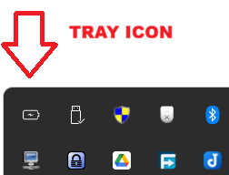
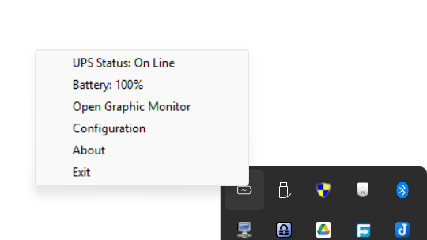
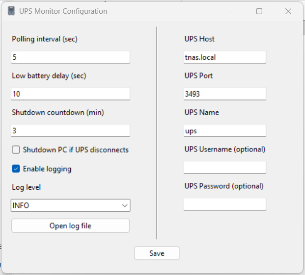
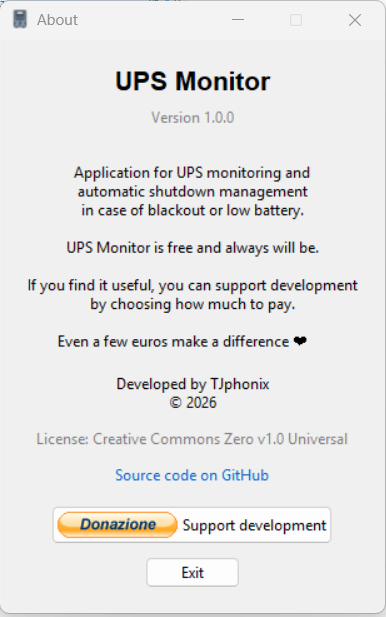
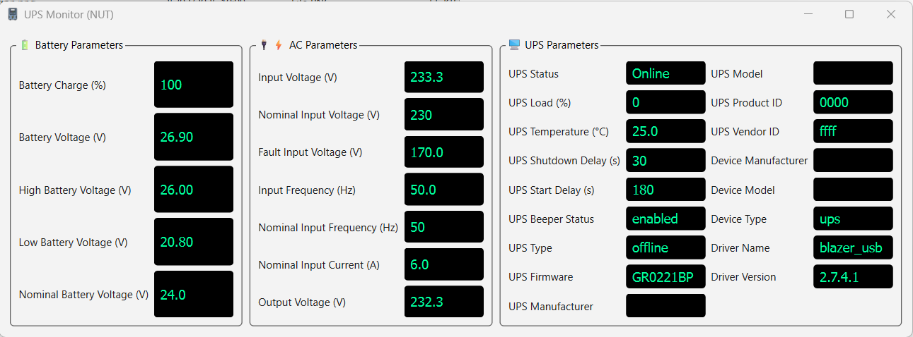

## 📦 Download

Scarica l’ultima versione stabile di **UPS Monitor** dalla sezione Releases:

👉 [Download latest release](https://github.com/USERNAME/REPO/releases/latest)

Include installer e tutte le versioni precedenti.
# ⚡ UPS Monitor

UPS Monitor è un software gratuito per il monitoraggio di gruppi di continuità (UPS) e la gestione automatica delle azioni di sicurezza in caso di blackout o batteria scarica.

È progettato per ambienti domestici e small office e consente il controllo centralizzato di un UPS collegato a un NAS Terramaster (TOS) (o di altra marca) e a più PC presenti sulla stessa rete locale.

---

## 🎯 Obiettivo

Garantire continuità operativa e sicurezza dei dispositivi collegati all’UPS, automatizzando il monitoraggio e le azioni di spegnimento in caso di emergenza.

---

## ✨ Funzionalità

- 📊 Monitoraggio in tempo reale dello stato dell’UPS
- ⚡ Rilevamento blackout e stato batteria
- 🔔 Notifiche di stato e allarmi
- 💻 Spegnimento automatico di PC e NAS in rete
- 🖥️ Interfaccia grafica desktop leggera
- 📌 Icona residente nella system tray

---

## 📦 Installazione

1. Scaricare l’ultima versione dalla sezione **Releases**
2. Avviare il file di installazione (`.exe`)
3. Seguire la procedura guidata
4. Avviare UPS Monitor

> Non è richiesta installazione di Python o dipendenze aggiuntive

---

## ⚙️ Configurazione

La configurazione avviene tramite interfaccia grafica.

Parametri principali:

- Indirizzo UPS / server NUT
- Dispositivi da monitorare in rete
- Soglie batteria e timeout
- Azioni di spegnimento automatico

Le impostazioni vengono salvate localmente in formato JSON.

---

## 🖥️ Interfaccia

Di seguito alcune schermate dell’applicazione.

<table>
  <tr>
    <td align="center">
      <b>⚡ System Tray</b> 
      
    </td>
    <td align="center">
      <b>📋 Menu rapido</b> 
      
    </td>
  </tr>

  <tr>
    <td align="center">
      <b>⚙️ Configurazione</b> 
      
    </td>
    <td align="center">
      <b>ℹ️ Informazioni</b> 
      
    </td>
  </tr>

  <tr>
    <td colspan="2" align="center">
      <b>📊 Monitor</b> 
      
    </td>
  </tr>
</table>

---

## 📁 Distribuzione

UPS Monitor viene distribuito esclusivamente come eseguibile Windows.

Non è necessario accedere al codice sorgente per l’utilizzo.

---

## ⚠️ Requisiti

- Windows 10 / 11
- Connessione LAN o Wireless attiva

---

## 💡 Supporto al progetto

UPS Monitor è sviluppato e mantenuto in modo indipendente.

Se il software ti è utile, puoi supportare lo sviluppo con una donazione volontaria:

👉 💖 Dona tramite PayPal

Le donazioni sono completamente volontarie e aiutano a migliorare il progetto nel tempo.

---

## 📌 Note

Il progetto è in continua evoluzione e verranno rilasciati aggiornamenti con nuove funzionalità e miglioramenti.

---

## 📜 Licenza

Copyright © 2026 UPS Monitor

Questo software è proprietario.

Tutti i diritti sono riservati.

L’utilizzo è consentito esclusivamente tramite le versioni ufficiali distribuite dall’autore.

Non è consentito:
- decompilare o effettuare reverse engineering
- modificare il software
- redistribuire versioni modificate
